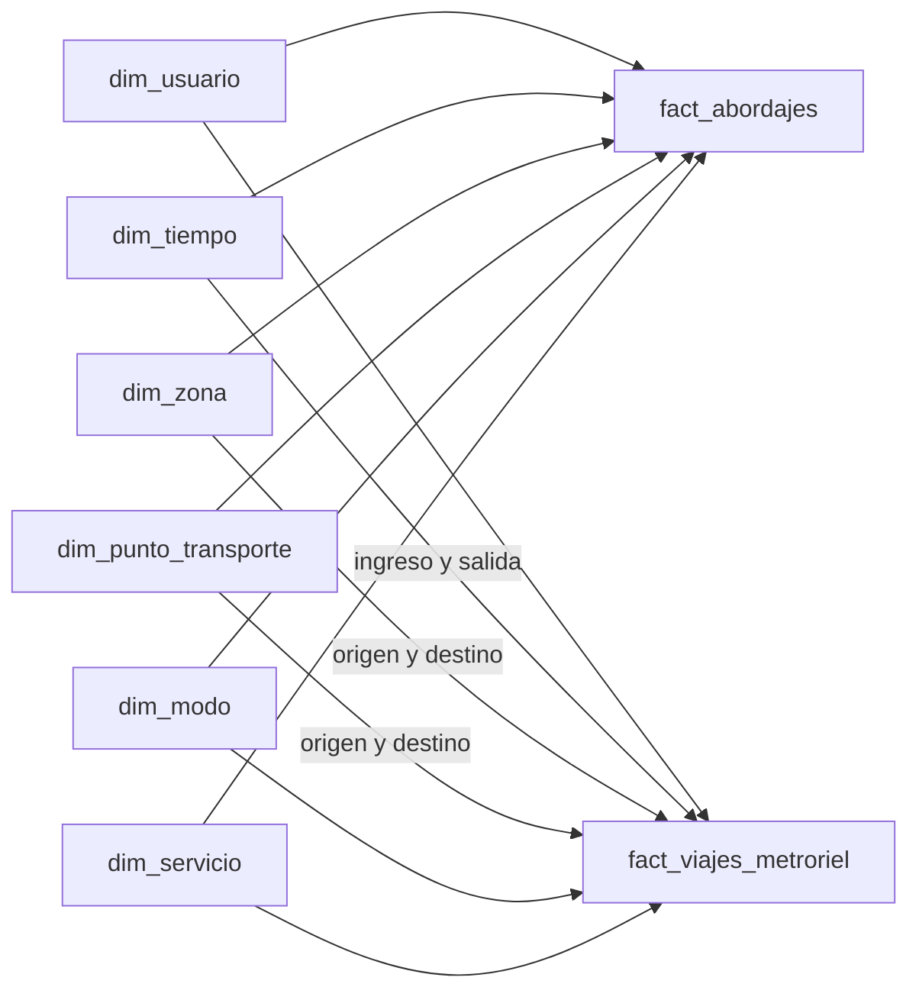

# Modelo dimensional Gold — Fase 1, punto 1.4

## Arquitectura y granos

Gold lee únicamente modelos Silver mediante `ref()`. `silver_catalogo_puntos` conforma los cuatro catálogos de Staging en Silver y aporta código, nombre, modo, zona, servicio y coordenadas cuando existen.

- `fact_abordajes`: **una fila por evento válido de acceso/abordaje** de Transmetro, Transurbano o Aerómetro, asociado a usuario, punto y fecha-hora. No contiene un destino porque esas fuentes no lo proporcionan.
- `fact_viajes_metroriel`: **una fila por viaje válido y cerrado** de MetroRiel. Conserva, por claves de dimensiones, estaciones y zonas de origen y destino, momentos de ingreso y salida y usuario; también tarifa y duración.

Ambos hechos conservan `fuente_evento`. Los hechos no contienen identificadores de tarjeta ni hashes de usuario originales. Las claves de evento se derivan de `bronze_record_id`, transportado hasta Silver, y no del `id_transaccion` de Transurbano basado en `row_number()`.

## Matriz del bus

| Proceso | Usuario | Tiempo | Zona | Punto | Modo | Servicio | Destino |
|---|:---:|:---:|:---:|:---:|:---:|:---:|:---:|
| Abordajes Transmetro | ✓ | acceso | acceso | estación | ✓ | línea | — |
| Abordajes Transurbano | ✓ | acceso | acceso | parada | ✓ | ruta | — |
| Abordajes Aerómetro | ✓ | abordaje | abordaje | estación | ✓ | eje | — |
| Viajes MetroRiel | ✓ | ingreso y salida | origen y destino | origen y destino | ✓ | servicio general | ✓ |

## Dimensiones

| Dimensión | Contenido y regla |
|---|---|
| `dim_usuario` | Una fila por identidad canónica Silver seudonimizada; incluye cantidad de modos observados y método de vinculación, sin llaves operacionales. |
| `dim_tiempo` | Un instante local observado con precisión de segundo, compartido por ambos hechos; clave `YYYYMMDDHHMMSS`, fecha, año, mes, día, día ISO (lunes=1), hora, minuto y segundo. |
| `dim_zona` | Zonas conformadas de los catálogos Silver, incluida `Desconocida` cuando falta zona. |
| `dim_punto_transporte` | Un punto por `(modo, código natural)`; nombre, zona, servicio del catálogo y latitud/longitud cuando existen. |
| `dim_modo` | Transmetro, Transurbano, MetroRiel y Aerómetro. |
| `dim_servicio` | Línea TM, ruta TU, eje AM y `SERVICIO_GENERAL` para MR. El origen no entrega un número de línea MetroRiel; no se inventa. |

La zona de Transmetro se obtiene de `tm_estaciones`; las dos zonas de MetroRiel se obtienen de `mr_estaciones`. La conformación ocurre en Silver. Se comprobó que los eventos válidos actuales tienen correspondencia en los cuatro catálogos y en el puente de identidad. Si un lote futuro no la tuviera, la prueba de conteos Gold fallaría en lugar de aceptar silenciosamente una pérdida de hechos.

La dimensión de zona contiene las zonas observadas en catálogos. No se puede declarar que otra zona esté "sin servicio" sin un universo geográfico externo de zonas; las fuentes entregadas no lo incluyen.

**Día hábil:** lunes a viernes, sin calendario de feriados porque las fuentes no lo incluyen. **Hora pico:** en día hábil, desde las 06:00 hasta antes de las 09:00, o desde las 17:00 hasta antes de las 20:00, hora local de Guatemala. Es una regla analítica explícita, no una clasificación oficial del operador.

## Claves e identidad

- Punto: `md5(modo || ':' || codigo_punto)`.
- Zona: `md5(zona_conformada)`.
- Modo: `md5(modo)`.
- Servicio: `md5(modo || ':' || codigo_servicio_normalizado)`.
- Tiempo: fecha-hora local completa codificada como entero `YYYYMMDDHHMMSS`.
- Evento: `md5(modo || ':' || bronze_record_id)`.
- Usuario: HMAC-SHA256 de `bridge_identidad_usuario.usuario_canonico_id` con la clave privada estable `GOLD_PSEUDONYM_KEY` de `.env`.

Las claves son reproducibles al reconstruir dbt. La clave HMAC debe conservarse fuera de Git y mantenerse estable entre reconstrucciones; cambiarla exige reconstruir conjuntamente dimensión y hechos, y cambia las claves históricas. El SQL compilado de dbt puede contener el secreto y vive en `target/`, ignorado por Git: debe protegerse como material sensible local.
El usuario de PostgreSQL debe poder crear `pgcrypto` o tener la extensión instalada previamente; el hook del proyecto ejecuta `CREATE EXTENSION IF NOT EXISTS pgcrypto`.

El puente Silver relaciona TM/TU/MR por patrón numérico **solo como inferencia académica**; no demuestra identidad real. Aerómetro queda aislado porque no existe correspondencia fiable. `dim_usuario.modos_observados` y las claves compartidas en hechos permiten calcular multimodalidad observable bajo esta limitación.

## Medidas

| Medida | Clase | Interpretación |
|---|---|---|
| `cantidad_abordajes = 1` | Aditiva | Suma de accesos válidos TM/TU/AM. |
| `cantidad_viajes = 1` | Aditiva | Suma de viajes completos MR. |
| `tarifa_quetzales` | Aditiva | Suma de importes registrados; no representa necesariamente ingresos cobrados si la tarifa de origen es teórica. |
| `duracion_minutos` | Aditiva como total de minutos de viaje | Sumarla mide tiempo acumulado de los viajes, no tiempo de red único. |
| Usuarios distintos | No aditiva, derivada | `count(distinct usuario_sk)`; no se suman subtotales entre zonas o modos. |
| Tarifa o duración promedio | No aditiva, derivada | Cociente entre suma y cantidad de eventos/viajes; no promediar promedios sin ponderar. |

No hay una medida naturalmente semi-aditiva: las fuentes Gold son eventos, no saldos o inventarios de corte temporal.

## Diagrama

## Validación y DDL

`models/gold/schema.yml` comprueba claves primarias lógicas y relaciones. `gold_conteos_hechos` exige que los hechos tengan exactamente el volumen de Silver; `gold_sin_identificadores_crudos` vigila columnas de identidad prohibidas. El [DDL de referencia](../../sql/ddl/gold_model.sql) describe tipos, claves e índices para el entregable. dbt materializa tablas sin imponer físicamente esas restricciones; las pruebas dbt hacen la validación de los datos.
Se validó la sintaxis del DDL creando todas las tablas e índices en un esquema temporal dentro de una transacción PostgreSQL que terminó en `ROLLBACK`.
